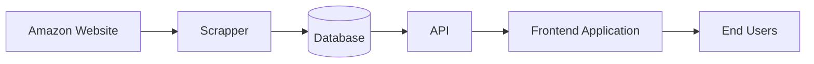

# Scoopy

<div align="center">


**Amazon and e-commerce price tracking platform**

Scoopy is a price monitoring platform focused on tracking product prices from Amazon and potentially other online retailers.

The main goal of this project is to collect historical price data, store it, and expose it through APIs that can later be consumed by a frontend application for visualization and analysis.

</div>

---

## Features

* Scrape Amazon product prices.
* Store historical price information.
* Expose APIs to query price history data.
* Designed to support multiple vendors in the future.
* Backend prepared for integration with a web frontend.

## Project Structure

```text
Scoopy/
├── assets/
│   └── logo.png
├── scrapper/   # Amazon web scraper and price collection logic
├── api/        # REST APIs for accessing stored data
└── README.md
```

## Architecture


