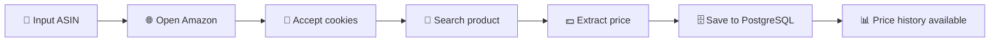
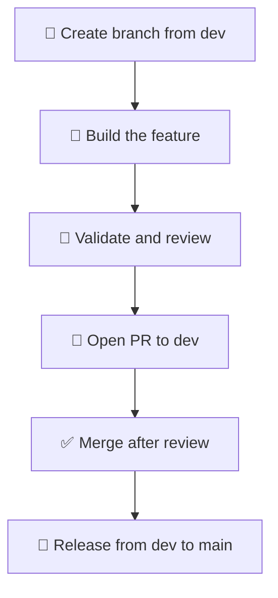

# Scrappy

📦 Scrappy is a lightweight TypeScript tracker for monitoring product prices on Amazon and potentially other sellers.

It helps you follow the price evolution of a product using its ASIN, collect the latest offer value, and persist that history in a PostgreSQL database for later analysis.

## 🔍 What Scrappy does

Scrappy acts as a small price-monitoring workflow:

- 🛒 It opens the Amazon product page and navigates the search flow.
- 💰 It extracts the current product price from the listing.
- 📈 It stores the product information and every observed price in a database.
- 🧠 It is designed to become the foundation for a broader price-tracking system that can later include additional sellers or marketplaces.

## 🧭 Workflow overview



## ✅ Requirements

Before running the project, make sure you have:

- Node.js and npm installed
- A PostgreSQL database available
- A browser runtime for Playwright

## Environment variables

The application expects the following variables to be defined in a `.env` file:

```env
PGHOST=localhost
PGPORT=5432
PGUSER=your_user
PGPASSWORD=your_password
PGDATABASE=your_database
```

These values are used by the PostgreSQL connection in the project.

## Database setup

The script expects the following tables to exist:

```sql
CREATE TABLE products (
  asin TEXT PRIMARY KEY,
  product_name TEXT NOT NULL
);

CREATE TABLE price_history (
  id SERIAL PRIMARY KEY,
  product_asin TEXT NOT NULL REFERENCES products(asin),
  price NUMERIC NOT NULL,
  currency TEXT NOT NULL,
  observed_at TIMESTAMP NOT NULL DEFAULT NOW()
);
```

## Installation

Install the dependencies:

```bash
npm install
```

If this is your first time using Playwright, install the browser binary:

```bash
npx playwright install chromium
```

## Build

Compile the TypeScript code:

```bash
npx tsc
```

## Usage

Run the scraper with an ASIN as argument:

```bash
node dist/function/main.js B08XYZ1234
```

The ASIN is passed as the first CLI argument and is used to search the product and store the result.

## 🌿 Branch workflow

The development process follows this flow:



- 🌱 New work starts from the `dev` branch.
- 🔀 When a feature is ready, a pull request is created targeting `dev`.
- ✅ After review, the branch is merged into `dev`.
- 🚀 If everything is stable, the changes are released from `dev` into `main`.
